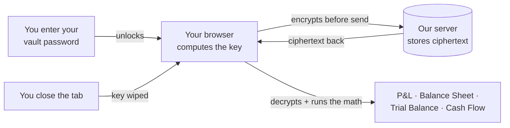

<div align="center">

# Orange Way Books

### Open-source bookkeeping where the app cannot read your books.

Bookkeeping that assumes the people running the servers — including us — should not be able to read your business. Built for Bitcoin businesses, useful for anyone who treats their financials as private. Self-hostable, auditable, Apache-2.0.

**Looking for accountants, bookkeepers, engineers, designers, and writers to help build this.** See [Join the build](#join-the-build).

[](./LICENSE)
[](./.github/workflows/ci.yml)
[](#status)
[](#why-this-exists)

[**What this is**](#what-this-is-in-one-minute) ·
[**Why**](#why-this-exists) ·
[**How it's different**](#how-its-different) ·
[**How it works**](#how-it-works) ·
[**Status**](#status) ·
[**Join the build**](#join-the-build) ·
[**Self-host**](#self-host)

</div>

---

## What this is, in one minute

Orange Way Books is a double-entry bookkeeping app for Bitcoin-native businesses. You enter your accounts, transactions, customers, vendors, payroll, and reports — the same things you'd enter into QuickBooks or Xero. What's different is that everything you type is encrypted on your computer before it leaves the browser. We hold the ciphertext; you hold the key. If our database is breached, an attacker gets opaque blobs and timestamps — not your books.

**Three honest caveats.** This matters because every privacy product over-promises, and most people don't want to read the small print:

1. **The app can't read your books — but your bank still keeps its own records.** When you connect a bank or exchange, the bank already has its copy of your transactions. We never see your bank login or the bank's plaintext data. But the categories, memos, journal entries, account names, customer records, vendor contracts, and balances _you_ enter into the app are encrypted on your device and unreadable to anyone but you.
2. **Anyone you grant access can read what they're allowed to read.** If you invite your accountant, they get keys to the rows you share. The privacy guarantee is against _the operator and any future buyer of the company_, not against people you intentionally invite.
3. **On-chain transactions remain on-chain.** Bitcoin's blockchain is public by design. We don't change that. The privacy boundary is the bookkeeping layer: your business interpretation of those transactions (memos, account assignments, internal notes) is what we cannot read.

---

## Why this exists

> _"Here we are faced with the problems of loss of privacy, creeping computerization, massive databases, more centralization — and \[David\] Chaum offers a completely different direction to go in, one which puts power into the hands of individuals rather than governments and corporations. The computer can be used as a tool to liberate and protect people, rather than to control them."_
>
> — **Hal Finney**, cypherpunks mailing list, November 1992

Thirty-four years later, every mainstream business-accounting product still operates the way Finney warned against.

**QuickBooks. Xero. FreshBooks. Wave. NetSuite. Sage.** Every single one stores your chart of accounts, customer details, vendor contracts, journal entries, payroll, margins, and runway in a form the operator's servers can read. _"Bank-level encryption"_ means TLS in transit and AES at rest — with the keys the operator holds. One breach, one subpoena, one curious employee, one rogue administrator, and years of financial narrative are legible to someone who is not your bookkeeper.

That bargain made sense when "the cloud" was new. It makes less sense when:

- **[LastPass was breached in 2022.](https://en.wikipedia.org/wiki/LastPass_2022_data_breach)** Encrypted vaults exfiltrated; master passwords brute-forced for years afterward. Federal prosecutors later [linked a $150 million crypto heist](https://krebsonsecurity.com/2025/03/feds-link-150m-cyberheist-to-2022-lastpass-hacks/) directly to that breach. What saved most users was strong passwords — not the vendor's architecture.
- **Intuit killed Mint in 2024**, forcing 3.6 million users to migrate or lose years of history under a 90-day deadline. Vendor risk is your risk.
- **Change Healthcare paid a $22M ransom in 2024** after attackers walked off with records on 100 million Americans. _"Bank-level encryption"_ is a marketing phrase, not an architectural claim.
- **Your business runs on Bitcoin** — a money system designed to remove trusted third parties — while your **books** still sit on a third party who can read them.

**Orange Way Books flips the model.** The browser holds the password. It derives a key that never leaves the device. Before anything touches the server, everything sensitive is encrypted. Reports and balances are computed in your browser, after unlock, using the key the server has never seen.

We did not invent "encrypt the database." We are building **bookkeeping that assumes the operator is adversarial** — including us — and still feels usable for a real company. [Read the threat model.](./SECURITY.md)

---

## How it's different

|                                                   | QuickBooks | Xero | FreshBooks | Wave | Sage | NetSuite | **Orange Way Books** |
| ------------------------------------------------- | :--------: | :--: | :--------: | :--: | :--: | :------: | :------------------: |
| Open source                                       |     ✗      |  ✗   |     ✗      |  ✗   |  ✗   |    ✗     |        **✓**         |
| Self-hostable                                     |     ✗      |  ✗   |     ✗      |  ✗   |  ✗   |    ✗     |        **✓**         |
| Bitcoin-native (on-chain + Lightning)             |     ✗      |  ✗   |     ✗      |  ✗   |  ✗   |    ✗     |        **✓**         |
| Server can read your chart of accounts            |     ✓      |  ✓   |     ✓      |  ✓   |  ✓   |    ✓     |        **✗**         |
| Server can read your journal entries              |     ✓      |  ✓   |     ✓      |  ✓   |  ✓   |    ✓     |        **✗**         |
| Server can read your payroll and vendor contracts |     ✓      |  ✓   |     ✓      |  ✓   |  ✓   |    ✓     |        **✗**         |
| Cannot be shut down by an acquirer                |     ✗      |  ✗   |     ✗      |  ✗   |  ✗   |    ✗     |        **✓**         |
| Published open threat model                       |     ✗      |  ✗   |     ✗      |  ✗   |  ✗   |    ✗     |        **✓**         |

Every other accounting product keeps the keys to read your books on its own servers. We keep only ciphertext plus transaction dates (needed so the server can answer "show me May" without reading the rows). If an attacker breaches our database, they get opaque blobs and row counts — not your margins.

This is the same architectural pattern used by [Bitwarden](https://bitwarden.com/help/bitwarden-security-white-paper/), [1Password](https://agilebits.github.io/security-design/), [Proton](https://proton.me/security/end-to-end-encryption), and [Signal](https://signal.org/docs/) — applied, for the first time, to double-entry business accounting.

---

## How it works



**In plain English:**

1. **You unlock once with a vault password.** That password never goes to our server — it stays in your browser session.
2. **Your browser computes a key from the password.** Everything sensitive you type into the app — account names, journal entries, customer details, memos — is encrypted with that key before it leaves your machine.
3. **The server stores only ciphertext.** Our database sees opaque blobs and timestamps. It cannot decrypt them. We cannot decrypt them.
4. **Reports run in your browser.** P&L, balance sheet, trial balance, general ledger, cash flow — all the math happens after decrypt, in the page you have open.
5. **Close the tab and the key is gone.** We never had a copy. If you forget your password and didn't print the recovery code, the data is unrecoverable. That is the cost of the privacy guarantee.
6. **You can invite people.** When you invite your accountant or a colleague, your browser wraps a copy of the key for them. Each invitee unlocks with their own vault password and gets only the rows their role can see.

The cryptography uses standard primitives in well-vetted combinations. Full details are in [`SECURITY.md`](./SECURITY.md).

---

## Who this is for

- **Bitcoin-native businesses** — miners, custodians, OTC desks, exchanges, Lightning service providers, Bitcoin-only funds — that want bookkeeping with the same trust posture as the money they handle.
- **Accountants and bookkeepers** serving Bitcoin clients who need full double-entry, IFRS/GAAP-aware reporting, but can't ethically upload client books to a vendor that can read them.
- **Privacy-conscious small businesses** that don't need Bitcoin specifically but refuse the "trust us with everything" bargain of generic SaaS accounting.
- **Engineers and auditors** who want a real accounting domain (chart of accounts, journal entries, reconciliation, reports) to stress-test a client-side encryption design.

---

## Status

**Early development. Working code, not vapor.** You can clone this repo, run it locally, create an organization, unlock the vault, and watch ciphertext go over the wire while the UI shows real numbers after decrypt.

**What works today:**

- Double-entry bookkeeping primitives: chart of accounts, journal entries, transactions, contacts, invoices, payment requests, attachments, audit logs.
- Reports: profit & loss, balance sheet, trial balance, general ledger, cash flow, FX revaluation. All computed in your browser.
- Client-side encryption for every business-sensitive field. Server stores ciphertext.
- Multi-user organizations with role-based access (Owner, Admin, Accountant, Bookkeeper, Auditor, and a "Support" time-boxed grant).
- Imports from CSV and from QuickBooks workbooks; data takeout to JSON.
- Optional integration with Orange Rails for bank and exchange feeds.
- A planned "blind-mode" double-entry ledger backend so the storage layer never sees plaintext amounts.

**What's next:**

- Hardening the deploy story: clearer self-host docs, better defaults, easier backup workflow.
- Polishing the import experience for accountants migrating from QuickBooks or Xero.
- Research into zero-knowledge proofs for audit attestations — prove your P&L is consistent without revealing line items.
- A self-hostable mobile app for transaction capture on the go.

**What's not built:**

- Payroll workflows (designed-for, not shipped).
- Tax-filing integrations (deliberately out of scope; export to your tax software).
- A SaaS hosted version, for now. The path is self-host first, hosted later if the community wants it.

---

## Join the build

This is a cypherpunk project. Its success depends on community scrutiny, not corporate marketing. Several kinds of help would make it real faster.

### Engineers

- **Cryptography audits.** `src/lib/vault.ts`, `src/lib/crypto-fields.ts`, and the multi-user invite + revoke flows in `src/lib/signing-key.ts` and `src/lib/rekey.ts` are where every privacy claim is made or broken. If you read security code for a living, please read these.
- **Frontend & TypeScript.** React + Vite + shadcn. Help with the import wizards, the period-close workflow, and the multi-currency reporting UX.
- **Backend & Postgres.** Supabase Edge Functions, row-level-security policies, blind-index patterns for searchable encrypted fields. The migrations in `supabase/migrations/` are the authoritative schema.
- **Ledger backend.** A Rust ledger backend with blind-mode journals lives under `legacy/`. If you like database internals and want to remove plaintext amounts from the storage layer entirely, this is the surface.
- **Bitcoin & Lightning connectors.** Orange Rails handles the aggregation layer (the equivalent of Plaid), but Bitcoin-native businesses want bookkeeping-aware integrations with the tooling they already run: BTCPay Server for invoicing, Mempool for on-chain reconciliation, Voltage / Umbrel / Start9 for self-hosted Lightning, Strike / Blink / Cashu mints for fiat-rails-plus-Lightning. Build the import/categorization story for any of these.

Start at [`docs/CONTRIBUTING.md`](./docs/CONTRIBUTING.md) and [`docs/OWB-ARCHITECTURE.md`](./docs/OWB-ARCHITECTURE.md).

### Designers

- Help the app feel like a tool an accountant trusts. The bar is QuickBooks-level polish on a privacy-first stack.
- The marketing site under `src/marketing/` is intentionally plain right now. Brand work, illustration, and visual hierarchy are wide open.
- Mobile and accessibility passes welcomed.

### Writers

- **The threat model** in [`SECURITY.md`](./SECURITY.md) is engineer-readable. It should also be lawyer-readable, CFO-readable, and journalist-readable. Help us say the same thing in three more voices.
- **The docs** in `docs/` are a mix of engineering specs and product narrative. Editing for clarity and consistency is high-leverage.
- **Tutorials.** Show an accountant how to migrate from QuickBooks. Show a Bitcoin miner how to map mining payouts to revenue. Show a Lightning service provider how to reconcile fee revenue against routed payments.

### Community

- **Star the repo** if the mission resonates — that signal helps every other contributor decide we're worth their time.
- **Open issues** with your worst SaaS-accounting story. Those sharpen the roadmap more than any feature spec.
- **Tell your favorite Bitcoin-company CFO.** The leverage point is one company switching, then describing why publicly.
- **Spread the word** on Nostr, Hacker News, r/Bitcoin, r/selfhosted, r/Accounting, on podcasts, at meetups.
- **Responsible security disclosure** — see [`SECURITY.md`](./SECURITY.md). Credit for verified findings.

If none of those fit, open a discussion on the repo and tell us how you'd help. We'll figure something out.

---

## Self-host

```bash
git clone https://github.com/The-Orange-Way/Orange-Way-Books.git
cd Orange-Way-Books
bun install --frozen-lockfile
cp .env.example .env   # fill in VITE_SUPABASE_URL + VITE_SUPABASE_PUBLISHABLE_KEY
bun run dev
```

The project is managed with [Bun](https://bun.sh). CI runs `bun install --frozen-lockfile` so the lockfile is authoritative.

- Apply the schema by running the migrations in `supabase/migrations/` against your Supabase project (`supabase db reset` locally, or the migration UI in the Supabase dashboard).
- Optional: connect an Orange Rails aggregator for bank and exchange feeds. See `docs/OWB-ARCHITECTURE.md` for the integration points.
- Run the linter and tests with `bun run lint` and `bun run test`.

---

## Documentation

| Doc                                                                    | What's in it                                                                                     |
| ---------------------------------------------------------------------- | ------------------------------------------------------------------------------------------------ |
| [`docs/OWB-ARCHITECTURE.md`](./docs/OWB-ARCHITECTURE.md)               | System overview, data flow, what's encrypted vs. plaintext.                                      |
| [`docs/CONTRIBUTING.md`](./docs/CONTRIBUTING.md)                       | Commit-message conventions, PR style, branch model, security rules.                              |
| [`docs/DOCUMENTATION-INDEX.md`](./docs/DOCUMENTATION-INDEX.md)         | Map of every doc and when to read which.                                                         |
| [`docs/OWB-ZKA-BRIDGE.md`](./docs/OWB-ZKA-BRIDGE.md)                   | Engineering work-stream index.                                                                   |
| [`docs/OWB-MULTIUSER-DESIGN.md`](./docs/OWB-MULTIUSER-DESIGN.md)       | Multi-user organization design (roles, key hierarchy, invite + revoke).                          |
| [`docs/OWB-USER-MANAGEMENT-ZKA.md`](./docs/OWB-USER-MANAGEMENT-ZKA.md) | Track-D multi-user spec (per-org key, hybrid post-quantum wrap, custody options).                |
| [`docs/OWB-MultiCurrency-Brain.md`](./docs/OWB-MultiCurrency-Brain.md) | Multi-currency, FX, IFRS vs. GAAP. The accountant-readable reference.                            |
| [`docs/COMPETITIVE-ANALYSIS.md`](./docs/COMPETITIVE-ANALYSIS.md)       | Survey of role models across QuickBooks, Xero, Wave, Zoho, FreshBooks, Odoo, ERPNext, Akaunting. |
| [`SECURITY.md`](./SECURITY.md)                                         | Threat model, cryptographic primitives, key rotation, disclosure policy.                         |

---

## Cypherpunk lineage

Orange Way Books stands on thirty-five years of cypherpunk thought.

- **Satoshi Nakamoto**, Bitcoin whitepaper (2008) — _"electronic cash without going through a financial institution."_ [[bitcoin.org]](https://bitcoin.org/bitcoin.pdf)
- **Eric Hughes**, _A Cypherpunk's Manifesto_ (1993) — _"Privacy is the power to selectively reveal oneself to the world… Cypherpunks write code."_ [[activism.net]](https://www.activism.net/cypherpunk/manifesto.html)
- **Tim May**, _The Crypto Anarchist Manifesto_ (1988) — _"A specter is haunting the modern world, the specter of crypto anarchy."_ [[Nakamoto Institute]](https://nakamotoinstitute.org/library/crypto-anarchist-manifesto/)
- **Phil Zimmermann**, _Why I Wrote PGP_ (1991) — _"It's personal. It's private. And it's no one's business but yours."_ [[philzimmermann.com]](https://philzimmermann.com/EN/essays/WhyIWrotePGP.html)
- **Hal Finney**, cypherpunks list (1992) — _"The computer can be used as a tool to liberate and protect people, rather than to control them."_ [[Nakamoto Institute]](https://nakamotoinstitute.org/finney/)

---

## Related projects

- **[Orange Way Me](https://github.com/The-Orange-Way/Orange-Way-Me)** — the sibling project for households. Same architecture, applied to personal finance. Built for Bitcoin households whose bank, aggregator, and tracker should not be able to read what they store.
- **[Orange Rails](https://github.com/MorningRevolution/orangerails)** — open-source aggregator for bank and exchange feeds. Orange Way Books consumes Orange Rails feeds for connected accounts.

---

## License

Apache-2.0 — see [`LICENSE`](./LICENSE). Apache was chosen specifically for its explicit patent grant: the privacy techniques here are meant to spread, not be litigated.

---

_Orange Way Books — because "trust us with everything" is not a business model for your books._
