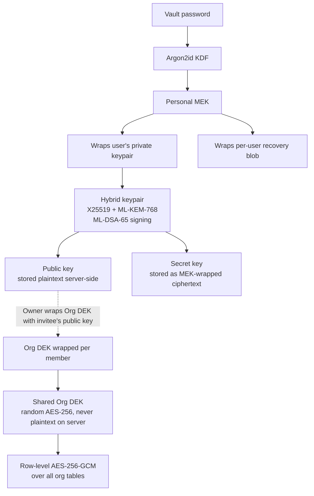
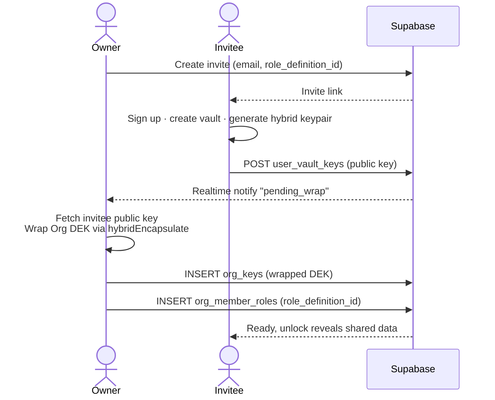
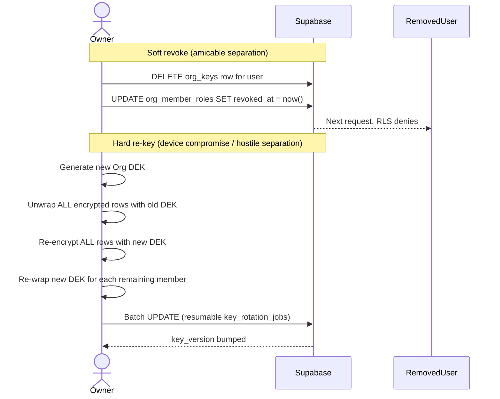

# Orange Way Books: Phase 4 Design: Multi-User Teams with Capability-Based Roles

> **Status:** Design spec, pending implementation.
> **Supersedes key parts of:** `OWB-USER-MANAGEMENT-ZKA.md` (older Track D, RSA-based).
> **Companion docs:** `COMPETITIVE-ANALYSIS.md` (research), `OWB-ZKA-BRIDGE.md` (Tracks for ledger storage, ledger engine, and encryption wiring).

---

## 0. Executive summary

Phase 4 adds **multi-user teams** to Orange Way Books without compromising zero-knowledge architecture (ZKA). The design rests on three decisions:

1. **Reuse Orange Rails' proven PQC primitive** (`pqc.ts` / `co-admin.ts` / `pqc-lifecycle.ts`) as the cross-app crypto library. No new cryptographic research; no RSA-OAEP-4096 as the older Track D doc suggested.
2. **Capability-based permissions**, not hardcoded roles. Roles are data-driven bundles of capability flags. New features (Invoicing, Inventory, Payroll) plug in by INSERT into the capability registry, existing roles are not disturbed.
3. **Preset role templates** ship as the default UX, but Owner/Admin can clone any preset, add or remove capabilities, and assign the custom role. Modelled on QuickBooks Online Advanced's Custom Roles, with fixes for QBO's known gaps (no true read-only default, silent skipping of custom roles on new-feature migrations).

The design has been validated against a survey of eight accounting platforms (QuickBooks Online, Xero, Wave, Zoho Books, FreshBooks, Odoo Accounting, ERPNext, Akaunting), see the companion competitive analysis doc.

---

## 1. Shared cryptographic primitive

Every user has the **same crypto identity** across all OWB contexts (organization workspace, personal household, Orange Rails workspace). Only the data key (DEK) they hold changes per context.



**Properties**

- Server sees: identity, role grants, wrapped keys, public keys, ciphertext rows. Never the DEK, never plaintext books.
- **Password change re-wraps only the private key**, the Org DEK is untouched. No full data re-encrypt.
- **Post-quantum safe**: X25519 fallback if ML-KEM is later broken, ML-KEM fallback if X25519 is broken. Hybrid by design.

**Libraries** (all pure-TypeScript, audited):

- `@noble/curves`, X25519
- `@noble/post-quantum`, ML-KEM-768, ML-DSA-65
- `@noble/hashes`, HKDF-SHA-256 combiner

**Files to extract from Orange Rails into a shared package:**

- `pqc.ts`, hybrid KEM + ML-DSA signatures
- `co-admin.ts`, grant / consume / revoke lifecycle
- `pqc-lifecycle.ts`, keypair generation + MEK-wrapping of private keys
- `key-wrapping.ts`, per-recipient wrap helpers
- `key-derivation.ts`, HKDF subkey derivation with named contexts

---

## 2. Capability-based permission model

### 2.1 Why not hardcoded roles?

A matrix of 9 roles × N capabilities **hardcodes** the role-to-permission relationship. The moment we ship Invoicing, Inventory, Payroll, Projects, 1099s, or Fixed Assets, we must:

- Re-open every role definition
- Guess which existing role gets the new permission
- Ship a migration that retro-grants existing users
- Invariably break someone's existing setup

Xero hit exactly this problem and is notorious for role rigidity ("can I have a role that reconciles banks but can't create invoices?", no). QuickBooks fixed it in QBO Advanced with Custom Roles.

### 2.2 Schema

```sql
-- NEW: source of truth for every capability in the app
CREATE TABLE public.capabilities (
  key              TEXT PRIMARY KEY,
  feature          TEXT NOT NULL,
  description      TEXT NOT NULL,
  requires_osk     BOOLEAN NOT NULL DEFAULT FALSE,  -- needs ML-DSA write signature
  requires_dek     BOOLEAN NOT NULL DEFAULT TRUE,   -- needs org DEK to decrypt
  added_in_version TEXT                              -- 'v4.0', 'v4.2' for migration tracking
);

-- NEW: bundles of capabilities, presets ship as is_system=TRUE, custom as is_system=FALSE
CREATE TABLE public.role_definitions (
  id          UUID PRIMARY KEY DEFAULT gen_random_uuid(),
  org_id      UUID REFERENCES public.organizations(id),  -- NULL for global presets
  name        TEXT NOT NULL,
  is_system   BOOLEAN NOT NULL DEFAULT FALSE,
  description TEXT,
  UNIQUE (org_id, name)
);

CREATE TABLE public.role_capabilities (
  role_id        UUID REFERENCES public.role_definitions(id) ON DELETE CASCADE,
  capability_key TEXT REFERENCES public.capabilities(key),
  PRIMARY KEY (role_id, capability_key)
);

-- MODIFIED: org_member_roles points to role_definitions (replacing the fixed role TEXT column)
ALTER TABLE public.org_member_roles
  ADD COLUMN role_definition_id UUID REFERENCES public.role_definitions(id);
-- keep legacy 'role TEXT' for one release, then drop
```

### 2.3 Adding a new feature, Invoicing example

When Invoicing ships:

```sql
INSERT INTO capabilities (key, feature, description, requires_osk, added_in_version) VALUES
  ('invoices.read',     'invoicing', 'View customer invoices',      FALSE, 'v4.2'),
  ('invoices.create',   'invoicing', 'Draft new invoices',          TRUE,  'v4.2'),
  ('invoices.send',     'invoicing', 'Send invoices to customers',  TRUE,  'v4.2'),
  ('invoices.void',     'invoicing', 'Void posted invoices',        TRUE,  'v4.2'),
  ('invoices.approve',  'invoicing', 'Approve invoice before send', TRUE,  'v4.2');
```

The migration auto-adds opinionated defaults to **system presets only** (`invoices.read` + `invoices.create` into Accountant, `invoices.approve` into PaymentsApprover). **Custom roles are never auto-modified**, the Owner sees a "new capabilities available" diff view and chooses.

This is the QBO Advanced pattern, but fixing QBO's known gap of silently skipping custom roles.

### 2.4 Hard requirements for not breaking the app

A capability can be **added or removed from a user mid-session** without any feature breaking:

1. **Every page / API handler checks capabilities independently.** No code branches on role name. No `if (role === 'Owner') …` anywhere.
2. **Graceful degradation on capability removal.** If a user loses `transactions.read`, the page returns an empty set or a clear "No access" state, not a 500.
3. **Capability changes are transactional.** Add + remove + audit write in one DB transaction.
4. **Client re-fetches capability set on change.** A Supabase realtime channel (`org_member_roles` changes) triggers `useRoles()` hook refresh.
5. **New features never assume a capability exists.** Every capability check must cope with the capability missing (e.g., feature gates, or graceful "ask your Owner to enable" flows).

### 2.5 RLS policy pattern

All RLS policies check capabilities, not role names:

```sql
-- Helper: does user have capability X in org Y?
CREATE OR REPLACE FUNCTION public.user_has_capability(
  p_user_id UUID, p_capability TEXT, p_org_id UUID
) RETURNS BOOLEAN
LANGUAGE sql SECURITY DEFINER STABLE
AS $$
  SELECT EXISTS (
    SELECT 1
    FROM public.org_member_roles omr
    JOIN public.role_capabilities rc ON rc.role_id = omr.role_definition_id
    WHERE omr.user_id = p_user_id
      AND omr.org_id = p_org_id
      AND rc.capability_key = p_capability
      AND omr.revoked_at IS NULL
      AND (omr.expires_at IS NULL OR omr.expires_at > now())
  );
$$;

-- Example: only users with transactions.write may INSERT
CREATE POLICY tx_insert_requires_cap
  ON public.transactions
  FOR INSERT TO authenticated
  WITH CHECK (public.user_has_capability(auth.uid(), 'transactions.write', org_id));
```

---

## 3. Role presets (v4.0 ship list)

Nine system presets ship out of the box. Every one is a `role_definitions` row with `is_system = TRUE` and a curated capability set. Owners can clone any of these to create org-specific custom roles.

| Preset                        | Has Org DEK?                | Has signing key?         | Read books | Write transactions | Write others' work | Approve payments | Mark paid | Close periods          | Manage users + keys | Time-bounded? |
| ----------------------------- | --------------------------- | ------------------------ | ---------- | ------------------ | ------------------ | ---------------- | --------- | ---------------------- | ------------------- | ------------- |
| **Owner** Full                | Yes                         | All                      | Yes        | Yes                | Yes                | Yes              | Yes       | Yes (sole)             | No                  |
| **Admin** Full                | Yes                         | All                      | Yes        | Yes                | Yes                | Yes              | No        | Yes (not other admins) | No                  |
| **Accountant** Full           | Yes                         | All                      | Yes        | Yes                | No                 | No               | Yes       | No                     | No                  |
| **Bookkeeper** Full           | Yes                         | All                      | Yes        | Own only           | No                 | No               | No        | No                     | No                  |
| **PaymentsApprover** Full     | Yes (scoped)                | All                      | No         | No                 | Yes                | No               | No        | No                     | No                  |
| **PaymentsPayer** Full        | Yes (scoped)                | All                      | No         | No                 | No                 | Yes              | No        | No                     | No                  |
| **Auditor** Full (read-only)  | No, cryptographic read-only | All                      | No         | No                 | No                 | No               | No        | No                     | Yes (`expires_at`)  |
| **Viewer** Full (read-only)   | No                          | Reports + summaries      | No         | No                 | No                 | No               | No        | No                     | Optional            |
| **OWBSupport** Scoped sub-DEK | No                          | Owner-selected rows only | No         | No                 | No                 | No               | No        | No                     | Short TTL + sweep   |

### Three-layer read-only (Auditor)

1. Auditor has the **Org DEK wrap** → can decrypt.
2. Auditor does **not** have the **Org Signing Key (ML-DSA-65)** → writes cannot be signed.
3. RLS capabilities deny Auditor write ops anyway.

Defense-in-depth: a bug in one layer doesn't bypass the others.

### Separation of duties

PaymentsApprover and PaymentsPayer are intentionally distinct. Assigning both to the same user is allowed but UI-warned and compliance-report-flagged, some small teams need it, larger teams must split.

---

## 4. Invite / revoke / re-key flows

### 4.1 Invite



**Bitwarden pattern**: Owner must be online to complete the wrap. If Owner is offline > 24h, push/email nudge to the Owner. This is accepted for v1; async key-agreement is a future enhancement.

### 4.2 Revoke



| Action                                                                            | When to use              | Speed                                                                         | Safety |
| --------------------------------------------------------------------------------- | ------------------------ | ----------------------------------------------------------------------------- | ------ |
| **Soft revoke** Amicable separation, no suspicion                                 | Instant                  | Protects future access; cached keys in their browser persist until tab closes |
| **Hard re-key** Device compromise, hostile termination, end of OWBSupport session | Minutes–hours, resumable | Strongest, new DEK, batch re-encrypt, `key_version` bumped                    |

---

## 5. Stress-test scenarios

All 12 flows MUST be representable without custom code. These validate the design, not the implementation.

### Accounting workflow

1. **Bookkeeper → Accountant → Approver → Payer chain.** Each step requires a distinct capability AND a distinct ML-DSA signature from a distinct user.
2. **Month-end close lockdown.** Accountant closes April. No role except Owner can write to closed-period rows. Enforced by `periods.unlock` capability + signing-key gate.
3. **External CPA engagement.** Firm gets Accountant role for 90 days; auto-revoke on `expires_at`. Audit log captures every access.

### People lifecycle

4. **Owner on vacation, urgent invoice.** Admin can approve without the Owner online, `payments.approve` is in Admin's capability set.
5. **Employee quits amicably.** Soft revoke. Cached subkeys in their browser tab persist until logout; documented as a known limitation.
6. **Laptop stolen, suspicion of compromise.** Hard re-key. Owner initiates; progress UI; resumable.
7. **Forgot password + recovery code used.** User unlocks with recovery code; personal MEK re-wraps private key; **Org DEK wraps unchanged**, their role and access survive. No re-invite.

### Platform growth

8. **New feature: Invoicing ships.** Capabilities INSERT; defaults assigned to system presets; custom roles untouched; Owner sees diff view and chooses.
9. **Franchise / multi-org.** User is Admin in Org A, Viewer in Org B. **One keypair per user**, different DEK wraps per org. `org_keys` keyed on `(org_id, user_id)`.
10. **SoD violation attempted.** Owner assigns same user as PaymentsApprover + PaymentsPayer. UI warns but allows; audit log flags; compliance report highlights.

### Edge cases

11. **Support session audit.** OWBSupport opens a 4-hour session. On close, sweep job revokes wrap. `key_audit_log` records wrap usage metadata. (Client-side decrypt events cannot be logged, by design.)
12. **Role cloned & modified.** Org clones "Bookkeeper" to "Night Bookkeeper", removes `transactions.write`. Org-local custom role. Other orgs unaffected. Future migrations to the built-in Bookkeeper never touch it.

---

## 6. Phased delivery

Each phase leaves `dev` deployable to staging and fit to promote into `prod`.

| Phase                                                                                                                                                                | Deliverable       | Estimated |
| -------------------------------------------------------------------------------------------------------------------------------------------------------------------- | ----------------- | --------- |
| **4.0** Extract OR's PQC primitive as shared library; port tests                                                                                                     | 1 week            |
| **4.1** Schema: `user_vault_keys`, `org_keys`, `capabilities`, `role_definitions`, `role_capabilities`, `org_member_roles` update; keypair lifecycle in unlock/setup | 1 week            |
| **4.2** Role presets seeded; `useRoles()` + `useCapability()` hooks; capability-checked RLS across all mutating tables; Admin UI to view/clone/edit roles            | 2 weeks           |
| **4.3** Real invites + Owner-side wrap + soft revoke + audit events to `vault_security_events`                                                                       | 1 week            |
| **4.4** Time-boxed Auditor + OWBSupport session + sweep job; signing key (ML-DSA-65) wrapped only for writer roles                                                   | 1 week            |
| **4.5** Hard re-key job + progress UI + resume; `key_rotation_jobs`                                                                                                  | 1–2 weeks         |
| **4.6** Paid-tier Shamir 2-of-3 custody + ops runbook                                                                                                                | Later (paid tier) |

Total: ~6–8 weeks for 4.0 through 4.5.

---

## 7. Patterns adopted from competitive research

Validated against QuickBooks Online (Simple Start → Advanced), Xero, Wave, Zoho Books, FreshBooks, Odoo Accounting, ERPNext, Akaunting. Full analysis: `COMPETITIVE-ANALYSIS.md`.

**Adopted:**

1. **Hybrid RBAC**, small named presets for 95% of users + full composable capability flags underneath for the power-user / compliance case. Xero gives you simplicity; Zoho + QBO Advanced give you customization. One engine serves both.
2. **Approve as a separate capability**, not a byproduct of Edit. Every mutation capability can have an optional `approve_*` twin. Mirrors Zoho Books' permission matrix and QBO Advanced's action granularity. Highest-value SOX / fraud-prevention control in the research.
3. **Module-declared permissions with auto-merge into system presets** on install, but NOT into custom roles without explicit admin consent (diff-view prompt). Odoo's `ir.model.access.csv` pattern, without ERPNext's trap of leaving Auditor stranded when new DocTypes arrive.
4. **Time-boxed / auto-expiring access** (Auditor `expires_at`, Support `TTL`). None of the 8 surveyed platforms ships this, greenfield differentiator.
5. **Read-only as a first-class built-in preset**, not an upsell or workaround. QBO's well-known gap. We ship Read-Only / Viewer on day one.

**Explicitly rejected:**

1. **Hardcoded roles (Xero, Wave pattern).** Saves engineering but guarantees customer complaints as the app grows.
2. **Hide-sensitive-pages-entirely (Wave pattern).** Role-gated UI is preferred over hardcoded-hide, it's inspectable, testable, and customizable.
3. **Silently skipping custom roles on new-feature migration (QBO gap).** Always surface a diff view to Owner.

---

## 8. Decisions locked

**Rule for future agents:** do not change anything in this section without explicit user approval. These decisions drive implementation and product packaging. If a decision seems wrong, raise it, don't silently refactor around it.

### Tier structure

**Locked.** No free tier. **Core plan** = the 9 fixed role presets (read-only). **Advanced + Enterprise plans** = full capability buffet: clone presets, add/remove capabilities, create custom roles from scratch.

Implementation gate: check the org's subscription tier before exposing clone/edit/create UI. Core users see presets only.

### Canonical preset names

**Locked.** Ship with: Owner, Admin, Accountant, Bookkeeper, PaymentsApprover, PaymentsPayer, Auditor, Viewer, OWBSupport. Rename later if customer feedback demands, cheap because names live in `role_definitions` rows.

### Invite wrap: who can complete it?

**Locked.** Any user with the `users.invite` capability can complete the hybrid-KEM wrap when a new member joins. In the default presets, that means **Owner and Admin**. Enterprise customers can extend to senior Accountants via custom roles.

Implementation: check `user_has_capability(auth.uid(), 'users.invite', org_id)`, not a hardcoded role check.

**Marketing copy angle:** lead with _"We don't have your keys, that's why your Owner has to unlock to let someone new in. Even we can't do it."_ Sovereignty is the pitch.

### Recovery custody (paid service, "Unchained-for-orgs" model)

**Locked.** Shamir 2-of-3 custody shipped as a **paid add-on SKU** (working name: **Orange Way Books Recovery**).

- Customer holds 2 shares (their own + nominated relative / partner / lawyer)
- Orange Way Books holds 1 share
- Recovery requires any 2

**v1 does NOT ship custody.** v1 requires mandatory recovery-code verification at vault setup (user types it back to confirm they wrote it down), catches ~95% of lost-password scenarios without the legal/ops burden. Shamir is deferred to Phase 4.6.

### Password change does NOT re-encrypt Org DEK

**Locked.** Password change re-wraps only the user's hybrid private key with the new MEK. Org DEK untouched.

**Not a ZKA-destroyer**, server never sees the plaintext private key. Industry standard (Bitwarden, Proton, 1Password all do this).

**Implementation guardrail:** use atomic UPDATE (not DELETE+INSERT) on `user_vault_keys`. Enforce with unit test: `SELECT count(*) FROM user_vault_keys WHERE user_id = X` must always equal 1. Leaving old ciphertext around lets an attacker with the old MEK decrypt the old private-key wrap.

### One master keypair per user (v1) + Enterprise tier for blast-radius (v2)

**Locked for v1.** One hybrid keypair per user globally, shared across all orgs. Works for solo Owners + small firms. Do NOT build per-org keypairs as default.

**v2 Enterprise tier** adds three additive layers, see `OWB-ENTERPRISE-SECURITY.md` for the full design:

1. **Hardware-backed master key (WebAuthn / passkey)**, master private key sealed to Yubikey / Apple Passkey / Windows Hello. Phishing the password without the physical device is useless.
2. **Device attestation + per-device session scoping**, stolen laptop = revoke the device, cryptographically dead. No re-key of N Org DEK wraps.
3. **Optional per-sensitive-client keypair enrollment**, opt-in compartmentalization for flagged high-sensitivity clients (defense, healthcare, high-net-worth).

**Why not per-org keypairs:** documented in `OWB-ENTERPRISE-SECURITY.md` §5. Short version: they solve nothing against phishing or malware, and cost 40+ unlocks for an accountant with 40+ clients. Hardware keys + attestation are the right answer.

### OWBSupport timing

**Locked.** Ships in Phase 4.4 (not v1). Enterprise customers are the primary buyers; we don't need it in the first multi-user cut.

---

## 9. Security properties

| Property                                | How                                                                        |
| --------------------------------------- | -------------------------------------------------------------------------- |
| Server never reads books                | Org DEK only in browser; server stores wraps + ciphertext                  |
| Each user has their own vault password  | Personal MEK unwraps only their own private key                            |
| Invite without sharing password         | Hybrid KEM wrap of Org DEK to invitee's public key                         |
| Revoke                                  | Soft = remove wrap; hard = new DEK + re-encrypt                            |
| Cryptographic read-only                 | signing key withheld from Auditor + RLS + UI                               |
| Post-quantum safe                       | X25519 + ML-KEM-768 hybrid                                                 |
| Capability changes never break features | RLS checks capabilities independently; client refetches on realtime change |

---

## 10. Monetization levers

The role and permission system creates natural pricing tiers, validated against how competitors actually monetize.

| Lever                                                                                                                | Segment precedent                                                                                                          | Orange Way Books angle |
| -------------------------------------------------------------------------------------------------------------------- | -------------------------------------------------------------------------------------------------------------------------- | ---------------------- |
| **Custom roles gated to paid tier** QBO Advanced (~$200/mo), Custom Roles is the headline feature behind the paywall | Free tier ships the 9 presets; paid unlocks clone + edit + create custom roles                                             |
| **External accountant seats** QBO ProAdvisor seats; Xero Adviser seats; Zoho's accountant plan                       | Firms managing N clients pay per-client; Auditor role with `expires_at` is the primitive                                   |
| **OWBSupport as concierge** Stripe, GitHub, and most B2B SaaS charge for priority support with direct session access | Time-boxed support sessions billable separately; the crypto primitive already enforces scope + TTL                         |
| **Per-seat pricing above N users** Standard SMB accounting SaaS pattern (QBO, Xero, FreshBooks)                      | First N users free, additional seats billed per month                                                                      |
| **Compliance / audit packs** Many platforms charge extra for SOC reports, detailed audit logs                        | `key_audit_log` + compliance report (SoD violations, role drift) is the free value prop; richer exports and retention paid |

The capability-based model is what makes these levers natural, tiers gate **which capabilities** a role can include, not which roles exist. That means the same underlying engine serves free and paid without forking code paths.

---

## 11. Cross-cutting risks

| Risk                                                         | Impact                                                  | Mitigation                                                                          |
| ------------------------------------------------------------ | ------------------------------------------------------- | ----------------------------------------------------------------------------------- |
| Owner device compromise                                      | All member DEK wraps exposed                            | Hard re-key on suspicion; short-lived Auditor/Support roles                         |
| Lost Owner password + lost recovery code                     | Whole org lost                                          | Shamir custody (paid tier) or mandatory recovery-code verification on setup         |
| Invite link phishing                                         | Attacker gets wrapped DEK but not the target user's MEK | Safe, DEK is wrapped under public key; unwrap requires target's MEK                 |
| Cached keys in revoked member's tab                          | Persist until tab close                                 | Document limitation; auto-logout hook on revoke via realtime channel                |
| Capability drift (features add caps, old custom roles stale) | Owners miss new permissions                             | Diff-view prompt on new-feature migration; admin dashboard flags stale custom roles |

---

## 12. References

- **Enterprise tier (v2 roadmap)**: `OWB-ENTERPRISE-SECURITY.md`, WebAuthn, device attestation, per-sensitive-client keypairs. Required reading before building v2.
- **Competitive analysis**: `COMPETITIVE-ANALYSIS.md`, 8 platforms, ~35 cited URLs.
- **ZKA tracks A–C**: `OWB-ZKA-BRIDGE.md`.
- **Track D framing + DDL sketches**: `OWB-USER-MANAGEMENT-ZKA.md`, updated to hybrid PQC.
- **Orange Rails PQC reference implementation**: `orange-rails/src/lib/pqc.ts`, `co-admin.ts`, `pqc-lifecycle.ts`.
- **Bitwarden security whitepaper**: https://bitwarden.com/help/bitwarden-security-white-paper/
- **NIST FIPS 203 (ML-KEM)**, **FIPS 204 (ML-DSA)**, **RFC 7748 (X25519)**.

---
